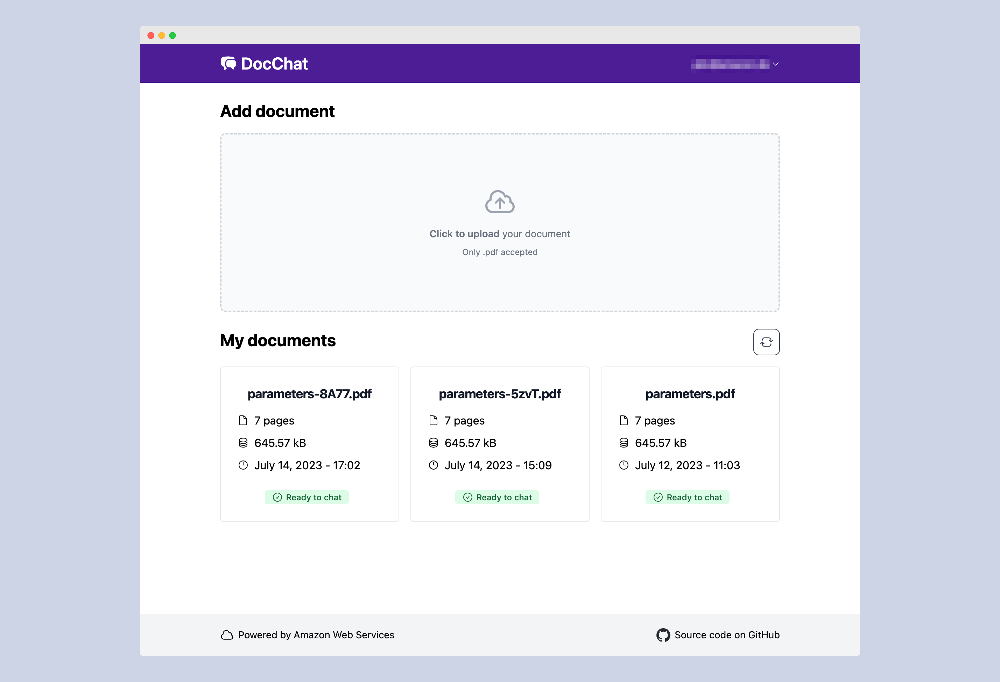
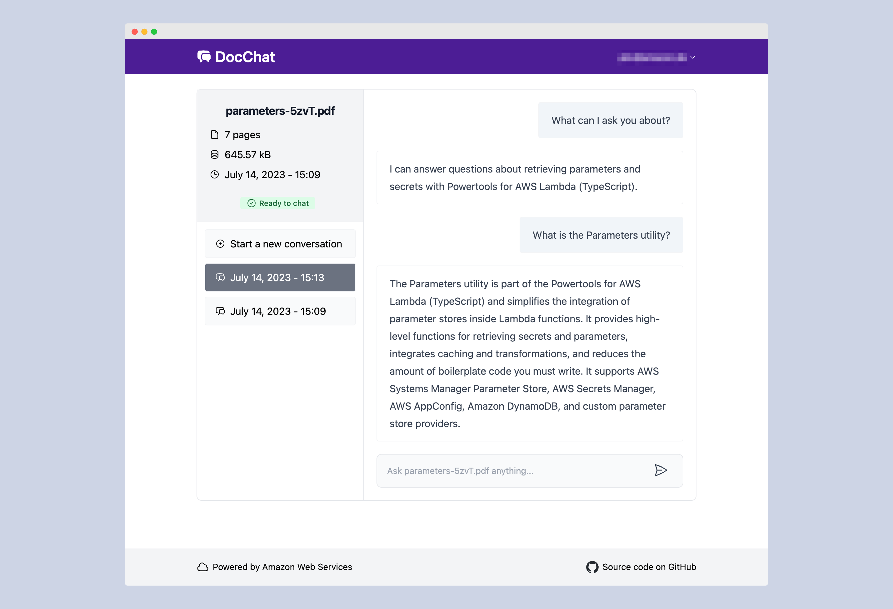
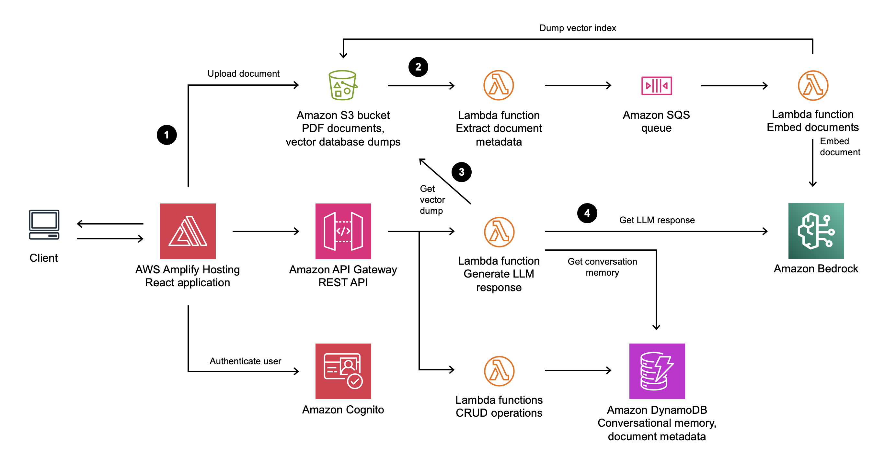

# Serverless PDF Chat with Crossplane and Kubernetes

This project is a Kubernetes-native implementation of the [AWS Serverless PDF Chat](https://github.com/aws-samples/serverless-pdf-chat) application, using Crossplane to manage cloud resources and Helm charts for deployment. It enables natural language interactions with PDF documents by combining the power of LLMs for text generation with vector search for document context retrieval.

<p float="left">
  
  
</p>

## Architecture Overview



This application maintains the serverless architecture of the original project, but uses Crossplane to provision and manage AWS resources through Kubernetes:

1. Users upload PDF documents to an Amazon S3 bucket through the React frontend
2. Document processing triggers a metadata extraction and embedding process using Amazon Bedrock
3. When users ask questions, a Lambda function retrieves relevant document vectors and contexts
4. An LLM (Amazon Bedrock) uses the retrieved context, conversation history, and its capabilities to generate responses

## Key Components

- **Frontend**: React application containerized with Nginx
- **Cloud Resources** (managed by Crossplane):
  - **Amazon Bedrock**: For serverless embedding and LLM inference
  - **AWS Lambda**: For serverless compute functions
  - **Amazon DynamoDB**: For document metadata and conversation storage
  - **Amazon S3**: For document storage and vector database
  - **Amazon SQS**: For processing queues
  - **Amazon Cognito**: For user authentication
  - **Amazon API Gateway**: For REST API endpoints

## Helm Chart Structure

The application is deployed using a set of Helm charts:

- **providers**: Installs Crossplane providers for AWS services
- **providerconfigs**: Configures AWS authentication and regions
- **compositions**: Defines high-level composite resources
- **serverless-pdf-chat**: The main application chart that provisions all components

## Prerequisites

- Kubernetes cluster (1.22+)
- [Crossplane](https://crossplane.io/) installed on your cluster
- [Helm](https://helm.sh/) (v3+)
- [kubectl](https://kubernetes.io/docs/tasks/tools/)
- AWS account with [Amazon Bedrock model access](https://docs.aws.amazon.com/bedrock/latest/userguide/model-access.html)
- Docker (for building images)
- AWS CLI (configured with appropriate credentials)
- [Replicated CLI](https://github.com/replicatedhq/replicated) (for packaging releases)

## Installation

### 1. Configure AWS Credentials

Ensure your AWS credentials are properly configured. Crossplane will use these to provision AWS resources.

```bash
aws configure
```

### 2. Install Crossplane Providers

```bash
helm install providers ./charts/providers
```

### 3. Configure Providers

```bash
# Create a secret with AWS credentials if not using instance roles
kubectl create secret generic aws-creds \
  --from-literal=aws_access_key_id=<YOUR_ACCESS_KEY> \
  --from-literal=aws_secret_access_key=<YOUR_SECRET_KEY>

# Install provider configurations
helm install providerconfigs ./charts/providerconfigs \
  --set aws.region=us-east-1 \
  --set aws.credentialsSecretName=aws-creds
```

### 4. Install Compositions

```bash
helm install compositions ./charts/compositions
```

### 5. Build and Push Docker Images

```bash
# Set environment variables
export AWS_REGION=us-east-1
export DOCKER_REGISTRY=<your-account-id>.dkr.ecr.us-east-1.amazonaws.com
export DOCKER_REPO=serverless-pdf-chat

# Login to ECR
make ecr-login

# Build and push all images
make images
```

### 6. Deploy the Application

```bash
helm install serverless-pdf-chat ./charts/serverless-pdf-chat \
  --set aws.region=us-east-1 \
  --set modelId=anthropic.claude-3-sonnet-20240229-v1:0 \
  --set image.repository=${DOCKER_REGISTRY}/${DOCKER_REPO}
```

### 7. Create a Cognito User

After deployment, create a user in the Cognito user pool:

1. Navigate to the AWS Cognito console
2. Find the user pool created by Crossplane
3. Add a new user with email and password
4. Use these credentials to log into the application

## Development

### Building Docker Images

```bash
# Build a specific image
make image-build-frontend

# Push a specific image
make image-push-frontend

# Build and push all images
make images
```

### Working with Helm Charts

```bash
# Lint charts
helm lint charts/serverless-pdf-chat

# Render templates
helm template charts/serverless-pdf-chat

# Package charts
make charts
```

### Packaging with Replicated

```bash
# Lint the release
make lint

# Create a release
make release
```

## Customization

### Model Selection

By default, this application uses:
- **Titan Embeddings G1 - Text** for vector embeddings
- **Anthropic Claude v3 Sonnet** for responses

To use different models, update the `modelId` value in your Helm chart:

```bash
helm install serverless-pdf-chat ./charts/serverless-pdf-chat \
  --set modelId=ai21.j2-ultra-v1
```

### Configuration Options

See the `values.yaml` files in each chart for detailed configuration options:

- `providers/values.yaml`: Crossplane provider versions and settings
- `providerconfigs/values.yaml`: AWS region and authentication
- `compositions/values.yaml`: Composition settings and references
- `serverless-pdf-chat/values.yaml`: Application-specific settings

## Security Notes

This application is designed for demonstration purposes and includes several security considerations for production use:

- Use AWS KMS with DynamoDB, SQS, and S3 for controlled encryption keys
- Configure API Gateway access logging and usage plans
- Enable S3 access logging
- Scope down IAM policies to more restrictive permissions
- Consider attaching Lambda functions to a VPC for network traffic inspection

## License

This project is licensed under the MIT-0 License. See the [LICENSE](LICENSE) file for details.